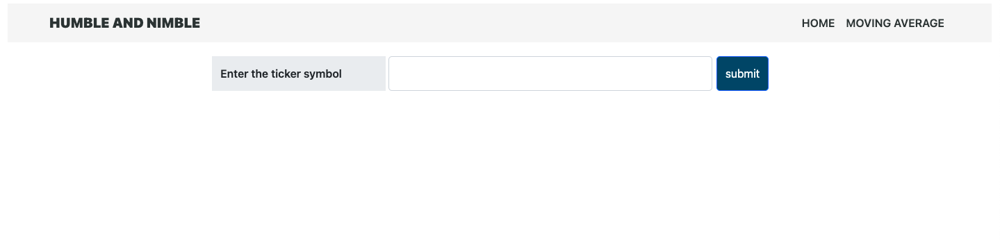
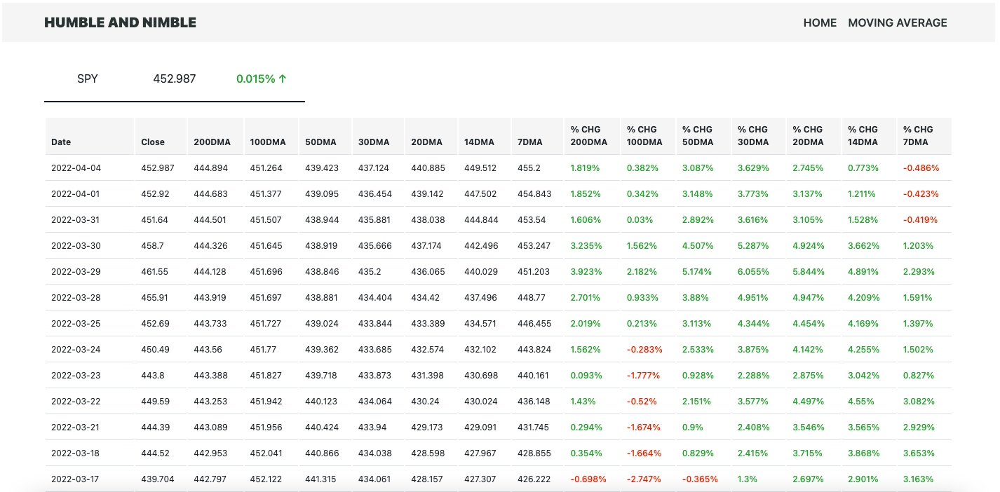

# HUMBLE AND NIMBLE

---

It is a simple application that provides basic technical details of the respective stock ticker

### Techincal Analysis

Technical analysis include the likes of moving averages and the current price actions compared to all respective moving average levels based on the window size

Considered moving average window sizes

* 7 sessions
* 14 sessions
* 20 sessions
* 30 sessions
* 50 sessions
* 100 sessions
* 200 sessions

